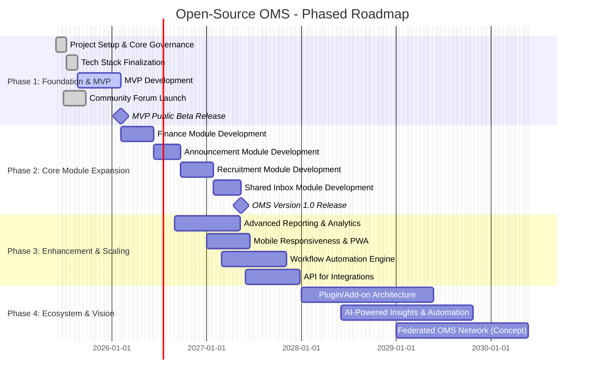
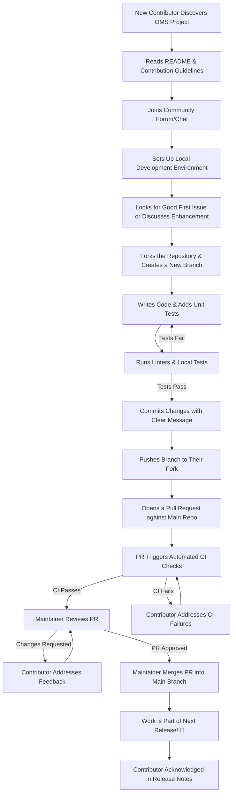

# Organization Management System: From Chaos to Clarity

**Tony An**, IS 340 Spring 2025, [ftan.dev](https://ftan.dev)

---

[TOC]

---

## Abstract

Volunteer-driven organizations are powerhouses of community impact, yet they often grapple with operational inefficiencies that divert energy from their core missions. This paper proposes a hypothetical open-source project: an Organization Management System (OMS) designed to bring "From Chaos to Clarity" for these vital groups. As a college student with an entrepreneurial spirit, a full-stack developer's mindset, a passion for cloud-native solutions, and a product manager's focus on user needs, I envision an OMS that is not just functional but transformative. This paper will detail the project's vision to enhance lives through technology, its architectural considerations, and a pragmatic management approach rooted in open-source principles. Specifically, it will delve into strategies for robust community building, dynamic workflow and roadmap design using Agile methodologies, and innovative approaches to ensure the project's long-term sustainability and growth, ultimately aiming to reclaim wasted hours for meaningful impact.

---

## Introduction: The Genesis of an Idea – Passion Meets Problem

As a student deeply immersed in the world of technology, I've always been captivated by its profound potential to not just solve intricate problems, but to genuinely enhance human lives. This fascination transcends mere academic interest; it's a core conviction that fuels my entrepreneurial aspirations and my hands-on work as a full-stack developer. Through my involvement in various student-led initiatives and observations of local community groups, I've witnessed firsthand the incredible passion and dedication these organizations embody. They are the unsung heroes, the engines of grassroots change. Yet, I've also seen them consistently bogged down by administrative chaos, their noble efforts often hampered by a glaring lack of accessible, efficient tools. Many resort to what can only be described as "duct tape + bubble gum" solutions — a frustrating patchwork of fragmented spreadsheets, never-ending email threads, and the all-too-common crisis of lost cloud drive access when leadership transitions. Having personally navigated these challenges in student groups, wrestling with inefficient processes that consumed precious time, I realized there had to be a better way.

This paper, therefore, outlines a hypothetical open-source project close to my heart: the Organization Management System (OMS). It's an endeavor born from a desire to bring order to this operational disarray and to empower these vital community groups. The vision is ambitious yet, I believe, achievable: to provide a comprehensive, intuitive, and entirely free platform that allows leaders to reclaim their valuable time and redirect their energy from the drudgery of mundane paperwork towards making a meaningful impact. This project is conceived through a multifaceted lens — that of a product manager obsessed with understanding and addressing user needs, a developer eager to architect and build robust, scalable solutions, and a cloud-native enthusiast committed to leveraging modern, efficient infrastructure. Crucially, the open-source model is not merely a distribution strategy; it is the philosophical cornerstone of the OMS, ensuring it remains accessible, adaptable, transparent, and perpetually driven by the community it aims to serve.

## The OMS Project: Vision, Scope, and Solution

The core challenge the OMS aims to dismantle is the pervasive operational inefficiency that plagues countless volunteer-run organizations. These groups, often the backbone of community engagement, face a common set of debilitating pain points: **Fragmented Information**, where critical data like contact lists, financial records, and event plans are scattered across disparate personal drives and emails, leading to what's aptly termed "roster chaos" and making knowledge transfer during leadership changes a recurring nightmare; **Manual Process Delays**, with leaders spending an inordinate amount of time on tasks like dues collection, sending reminders, and member onboarding—an administrative overhead that can consume over a thousand hours per leader annually, directly siphoning energy from mission-focused activities; **Lost Institutional Knowledge**, particularly acute in environments with high turnover like student organizations, forcing each new leadership cohort to essentially reinvent the wheel; **Inaccessible Systems**, exemplified by the common cry of "who owns that Gmail password?" or the crisis of vital documents locked away behind deactivated school credentials; and a general **Lack of Professional Tools**, as these organizations often lack the financial resources for sophisticated commercial CRM or ERP systems, leaving them to struggle with inadequate or ill-suited alternatives.

The **Project Vision Statement** for the OMS is therefore: **To be the leading open-source Organization Management System that empowers volunteer-led and community organizations globally to operate with seamless efficiency and transparency, thereby liberating their human capital to focus on creating meaningful impact and fostering vibrant, sustainable communities.**

To realize this vision, the OMS is conceived as a web-based, modular, and cloud-native platform. Its **High-Level Goals** are to democratize access to powerful management tools, cultivate a thriving global ecosystem of users and contributors, drastically reduce administrative overhead, enhance organizational resilience through better knowledge management and continuity, and champion the principles of openness and collaboration within the social sector. Over the first two years, **Specific Objectives** would include launching a stable Minimum Viable Product (MVP) focusing on a Central Hub, Unified Membership Management, and basic Document Management; establishing robust community infrastructure and attracting a core team of diverse contributors; onboarding an initial cohort of pilot organizations; and iteratively releasing further core modules such as Smart Finance, Announcements, basic Recruitment, and Shared Team Email functionalities.

The **OMS Solution** itself will offer a suite of integrated modules, designed for flexibility and community-driven enhancement:

*   The **Central Hub: The Command Center** will be a personalized dashboard offering an at-a-glance overview of key metrics and quick access to all functionalities.

*   **Unified Membership Management** will tackle "roster chaos" with real-time rosters, custom profiles, subscription management, automated reminders, and one-click online payment collection.

*   **Smart, Audit-Ready Finance** will bring clarity to financial operations for non-accountants, featuring live budget dashboards, approval workflows, evidence upload, audit trails, and no-code expense tracking.

*   **Targeted, Zero-Error Announcements** will streamline communication with selective targeting, a WYSIWYG editor, scheduled delivery, and open-rate analytics.

*   **End-to-End Recruitment** (with AI-Powered Filtering) will modernize volunteer and leader acquisition with custom forms, automated invites, and AI-driven candidate application review.

*   **Secure, Shared Team Email** will solve the "inaccessible inbox" problem through OAuth-connected mailboxes, role-based permissions, templates, and AI-assisted replies.

*   Finally, **Document & Knowledge Management** will be crucial for combating knowledge loss due to high turnover, offering a secure, version-controlled repository, templates, and wiki-like functionality to preserve institutional memory and simplify onboarding.

## Managing the Open-Source OMS: A Principled Approach

Successfully launching and nurturing an open-source project of this ambition requires more than just sound technical execution; it demands a deliberate and principled management philosophy. Drawing extensively from the insights and best practices explored in IS340, the management of the OMS would be anchored in three interconnected pillars: cultivating a vibrant community, implementing agile development with transparent roadmapping, and strategically planning for long-term sustainability. This approach ensures the project not only meets its initial goals but also evolves and thrives through collaborative effort.

### Cultivating a Vibrant Community: The Project's Lifeblood

An open-source project, at its core, is a socio-technical system; the "social" – the community – is arguably its most critical component (Raymond, 1999). For the OMS, building and nurturing a diverse, inclusive, and productive global community is not a secondary task but the very engine that will drive its success and impact. This begins with Defining a Resonant Community Purpose that extends beyond simply writing code. The OMS community would be united by the shared goal of empowering under-resourced organizations, fostering a space for shared learning where developers can hone full-stack and cloud-native skills while users master organizational management, and creating a robust peer-to-peer support network. Furthermore, the community itself would become a powerful advocacy group for both the OMS and the broader adoption of open-source solutions within the community and non-profit sectors.

To ensure this collaborative environment remains healthy and productive, **Establishing and Upholding a Code of Conduct** (CoC) from day one is non-negotiable. Adopting a widely recognized standard like the Contributor Covenant, making it highly visible, and instituting a clear, transparent, and impartial enforcement process handled by a trained committee will be paramount. This commitment to a safe and respectful space is crucial for attracting and retaining contributors from all backgrounds and experience levels. Beyond reactive enforcement, a proactive effort will be made to cultivate an inclusive culture through mindful language, the celebration of diverse forms of contribution (not just code), and dedicated onboarding paths for newcomers.

**Strategic Engagement and Contributor Recruitment** are essential for growth. This involves utilizing diverse communication channels—GitHub for code and issues, a Discourse forum for deeper discussions and Q&A, and perhaps a more real-time, open platform like Matrix or Zulip, complemented by regular project updates via a blog or newsletter. Lowering the barrier to entry is key, which means providing meticulously labeled "Good First Issues" catering to various skills (coding, documentation, UI/UX feedback, testing, translation) and offering mentorship opportunities, perhaps through a "buddy system" or virtual office hours with experienced contributors. Outreach efforts would be targeted: engaging university CS programs and developer communities by highlighting the modern tech stack, while simultaneously connecting with networks of non-profits and student associations to encourage user adoption, gather feedback, and potentially convert users into contributors. Critically, all forms of contribution must be consistently recognized and appreciated, fostering a sense of value and belonging. This active cultivation of **Social Capital**, as emphasized in the "Working Open ethos,"—building trust through transparency, encouraging innovation from all corners, fostering reciprocity where helping others is the norm, and acknowledging the altruistic motivations that drive many open-source participants—will be the bedrock of a resilient and dynamic OMS community.

### Agile Development and Transparent Roadmapping: Charting a Clear Course

Effective project management is the rudder that steers community efforts towards tangible outcomes. For the OMS, an **Agile approach, adapted for the nuances of open-source collaboration**, offers the necessary flexibility and responsiveness. Given that many contributors will be volunteers with varying time commitments, a rigid Scrum framework might prove challenging. Therefore, a **Hybrid Agile Methodology, blending elements of Scrum and Kanban**, seems most appropriate (Kniberg & Skarin, 2010). Core maintainers and dedicated contributors might adopt 2-4 week "sprints" for focused work on larger, well-defined features or modules, ensuring predictable progress on key initiatives. Simultaneously, a public Kanban board (via GitHub Projects) would manage a continuous flow of smaller enhancements, bug fixes, documentation updates, and contributions from occasional or new community members, visualizing the workflow from `Proposed` and `Backlog (Prioritized)` through `In Progress`, `In Review`, to `Done (Merged)` and `Released`. Communication will be a mix of regular, short virtual check-ins for the core team and broader, asynchronous monthly updates for the entire community, respecting diverse time zones and schedules.

Central to this agile process is a **Public Roadmap and meticulous Issue Management**. The roadmap, a living document hosted on the project website or GitHub wiki, will transparently outline major development themes, planned features for major releases (e.g., v1.0, v1.1), and tentative timelines. Feature prioritization will be a community-informed process, perhaps using methods like MoSCoW (Must have, Should have, Could have, Won't have) or the Eisenhower Matrix for task management by core members, always balancing user needs against community capacity. Each significant feature or task will have clearly defined deliverables and acceptance criteria. Potential risks—such as contributor burnout, scope creep, or security vulnerabilities—will be proactively identified, documented, and discussed with mitigation strategies. Progress towards key milestones will be publicly tracked, celebrating collective achievements. Effective **Issue Management** is the daily pulse of development. GitHub Issue templates will ensure bug reports and feature requests are submitted with necessary details. A comprehensive labeling system (`bug`, `enhancement`, `documentation`, `good first issue`, `module:membership`, `priority:high`) will facilitate filtering, prioritization, and assignment. Large features will be broken into manageable, optimally sized issues, each with a clear definition of "done," and a regular triage process by maintainers will keep the backlog healthy and accessible.

Finally, **Documentation as Community Organization** will be a core tenet (Ambler, 2002). Documentation is not a chore to be completed after coding; it is an integral part of the development process and a key tool for organizing a distributed community. The OMS will feature comprehensive, version-controlled "docs-as-code" catering to multiple audiences: clear user guides with screenshots and FAQs; detailed developer documentation covering setup, coding standards, and architecture; and explicit contributor guidelines. Making documentation easy to contribute to (e.g., via pull requests to Markdown files) provides another valuable pathway for community involvement, especially for non-coders.

### Ensuring Longevity: Strategies for Sustainable Open Source

The unfortunate reality is that many promising open-source projects eventually suffer from decay or abandonment (Fogel, 2005). To ensure the OMS not only launches successfully but endures and evolves as a valuable resource, a proactive and multifaceted approach to **Sustainability** is essential. This involves more than just keeping servers online; it means nurturing a resilient project and a self-perpetuating community. A primary strategy for **Combatting Project Decay is through Active Community Involvement and progressive Decentralization**. As the project matures, responsibilities for specific modules or functional areas (e.g., documentation lead, community manager for a particular region, release coordinator) will be identified and delegated to trusted, active community members. This distributes the workload, reduces dependency on a few key individuals, and fosters a stronger sense of shared ownership. Encouraging mentorship and robust knowledge transfer ensures that skills and project history are widely disseminated, facilitating smoother transitions if core maintainers step down. Maintaining project momentum through regular, predictable releases—even if they are small incremental improvements—and consistent, transparent communication about project status and future plans is vital for keeping the community engaged and confident in the project's long-term vitality. Continuously welcoming and effectively onboarding new contributors is also critical, as they bring fresh perspectives, energy, and skills, preventing the stagnation that often precedes project decline.

**Addressing Technical Debt Strategically** is another crucial aspect of long-term sustainability. Unmanaged technical debt can slowly erode a project's quality, making it harder to maintain and contribute to over time (Sharma et al., 2020). From the outset, the OMS project will cultivate a culture of quality by promoting good coding practices, mandating thorough code reviews (even for contributions from experienced developers), and integrating comprehensive automated testing into the CI/CD pipeline. A defined portion of development capacity, perhaps 10-20% within each development cycle or "sprint," will be explicitly allocated to refactoring existing code and addressing identified technical debt. The "Boy Scout Rule"—leaving the codebase cleaner than you found it—will be encouraged among all developers. Known areas of technical debt will be tracked using specific issue labels (e.g., `technical-debt`, `refactor-needed`), allowing them to be prioritized and addressed systematically rather than being ignored until they become critical problems.

While the OMS software itself will always be free and open-source, certain operational aspects—such as domain registration, hosting for the project website and community forum, legal advice, or potentially stipends for critical maintenance if volunteer capacity proves insufficient for urgent needs—may require financial support. Therefore, exploring **Diversified Funding and Support Models for FOSS** will be important for long-term viability. Any funds raised will be managed with complete transparency, ideally through a neutral fiscal host like Open Collective or the Software Freedom Conservancy, to build and maintain community trust. Potential avenues include soliciting individual donations via platforms like GitHub Sponsors or Patreon; seeking corporate sponsorships from companies that align with the OMS mission or benefit from its use (e.g., cloud providers offering service credits, businesses serving the non-profit sector); and applying for grants from foundations that support open-source software or digital infrastructure for community-focused initiatives. While more complex and requiring careful management to avoid distorting community motivations, a system of bounties for specific features or critical bug fixes could also be considered. Looking further into the future, and only with strong community consensus and a robust governance model that ensures all proceeds directly benefit the open-source project, the possibility of offering optional, paid value-added services (such as premium support tiers for larger organizations or managed hosting solutions for the OMS) could be explored. This path, however, must be navigated with extreme caution to preserve the project's core open-source ethos and the unwavering trust of its community.

## Technical Blueprint: Implementation and Architecture

Crafting the OMS requires not only a strong community and management philosophy but also a sound technical foundation. As a full-stack developer and cloud enthusiast, I envision a system that is modern, scalable, maintainable, and, crucially, inviting for new contributors to understand and enhance. The choice of Technology Stack is pivotal. For the backend, options like Golang or Node.js (with a framework like NestJS for structure, leveraging JavaScript's ubiquity) present strong cases due to their extensive ecosystems and large developer communities. On the frontend, a modern JavaScript framework such as React or Vue.js would enable the creation of a responsive, interactive, and modular user interface, with TypeScript adopted across the stack to enhance code quality and maintainability. For data persistence, robust open-source relational databases like PostgreSQL or MariaDB/MySQL are natural choices, potentially augmented by Elasticsearch or OpenSearch for advanced search capabilities as data volumes grow, and Redis or Memcached for performance-enhancing caching. The final stack selection would be a transparent, community-informed decision by the initial core team, prioritizing long-term health and contributor accessibility.

The **System Architecture** would ideally lean towards a microservices-oriented design, or at least a highly modularized monolith capable of evolving gracefully into microservices. This approach promotes scalability, independent module development and deployment, and fault isolation. Each major OMS function (e.g., Membership, Finance, Events) could be a distinct service or a clearly demarcated module with well-defined APIs (RESTful or GraphQL) facilitating interaction. This API-first design also paves the way for future third-party integrations. Containerization using Docker is a must, ensuring consistent development, testing, and production environments. As the project scales, orchestration with Kubernetes (K8s) would be the logical next step, aligning with a cloud-native philosophy that emphasizes automated deployment, scaling, and operational resilience. Designing services to be stateless wherever feasible will further simplify scaling and enhance fault tolerance.

A robust **Development Operations (DevOps) Culture and CI/CD Pipeline** are non-negotiable for an efficient and reliable open-source project of this nature. Version control will, of course, be Git, hosted on a platform like GitHub, which offers an integrated suite of tools including GitHub Actions for CI/CD, Issues for tracking, and Projects for agile board management. Automated workflows via GitHub Actions (or alternatives like Jenkins/GitLab CI) will handle building, comprehensive automated testing (unit, integration, and end-to-end tests using frameworks like Cypress or Playwright), code style enforcement (using linters such as ESLint, Prettier, Black, Flake8), and security vulnerability scanning (e.g., Snyk, Dependabot). Test coverage targets will be established and monitored to maintain code quality. Should the project require management of its own cloud infrastructure, Infrastructure as Code (IaC) tools like Terraform or Pulumi would be employed to ensure environments are reproducible, version-controlled, and can be provisioned on demand.

Finally, the choice of **Licensing** is a foundational decision that dictates the freedoms and obligations associated with the OMS. My strong inclination, aligning with the project's mission to provide an ever-improving, perpetually free tool for the community sector, would be towards a strong copyleft license like the **GNU General Public License v3 (GPLv3)** for the core system. The GPLv3 ensures that the OMS and any derivative works (modifications or extensions that are distributed) remain open-source, compelling improvements to be shared back with the community and preventing the project from being "closed off" or proprietarized. While more permissive licenses like MIT or Apache 2.0 might encourage broader adoption in some commercial contexts, they don't offer the same guarantee of reciprocal sharing, which is vital for the long-term health of a community-driven commons. The decision would ultimately be a community discussion, but the GPLv3 best protects the project's ethos and ensures its benefits are perpetually available to all. A Developer Certificate of Origin (DCO) would likely be preferred over a more formal Contributor License Agreement (CLA) to simplify the contribution process while still providing necessary legal assurances.

## Charting the Course: Roadmap and Collaborative Workflows

Visualizing the project's trajectory and defining clear pathways for contribution are essential for maintaining momentum and coordinating a distributed community. The OMS roadmap will be a living document, evolving with community input and capacity, while standardized workflows will ensure consistency and quality in collaborative development.

The **Phased Roadmap** for the OMS, as conceptualized below, categorizes work into "Earth Shots" (foundational MVP), "Moon Shots" (core module expansion), "Mars Shots" (significant enhancements and scaling), and "Jupiter Shots" (long-term ecosystem and visionary goals). This provides a clear, albeit high-level, view of the intended progression:

Phase 1 focuses on delivering tangible value quickly with core functionalities like a central dashboard, basic membership tracking, and document storage, alongside establishing the community infrastructure. Phase 2 expands on this by building out essential modules like finance, announcements, and initial recruitment and shared inbox capabilities, culminating in a robust Version 1.0. Phase 3 is about adding depth, improving usability (such as mobile responsiveness and Progressive Web App features), introducing powerful tools like advanced analytics and a workflow automation engine, and opening up the system via APIs for broader integration. The long-term vision in Phase 4 explores advanced extensibility through a plugin architecture, more sophisticated AI-powered insights, and even conceptual ideas like a federated network of OMS instances to foster inter-organizational collaboration.

To facilitate smooth collaboration, a clear **Example Workflow for Contributor Onboarding & First Contribution** is essential. This process, visualized below, guides a new developer from discovery to their first merged pull request, emphasizing documentation, community support, automated checks, and constructive code review.

## Conclusion: Beyond a Project – A Vision for Empowerment

The conception of an open-source Organization Management System, as detailed in this paper, transcends the mere technical blueprint of a software project. It represents a deeply held commitment to leveraging technology as a force for empowerment, specifically aimed at alleviating the operational burdens that too often stifle the potential of community and volunteer-led organizations. The journey "From Chaos to Clarity" is not just a tagline; it's a promise to transform the daily realities of leaders who are currently mired in fragmented contacts, wrestling with lost drive access, and battling manual workflows. By systematically addressing these pain points with an intuitive, integrated, and freely accessible platform, the OMS aims to return invaluable time and energy to these dedicated individuals.

Embracing the core principles of the open-source movement—transparency, collaboration, and shared ownership—is fundamental to this vision. The success of the OMS will not be measured solely by its feature set or the elegance of its code, but by the vibrancy and engagement of its global community of users and contributors. It is through this collective effort, guided by sound project management practices and a sustainable operational model, that the OMS can evolve into an indispensable tool, continually adapting to the diverse needs of the organizations it serves. As a student passionate about the confluence of technology, entrepreneurship, and social impact, this hypothetical project encapsulates an ideal application of my skills and aspirations. It offers the intellectual stimulation of complex full-stack development and cloud-native design challenges, the strategic considerations of user-centric product management, and the profound satisfaction of building something that can make a tangible difference. Ultimately, the true metrics of the OMS's success will be found in the hours reclaimed for mentorship and community programs, the new initiatives launched because administrative hurdles were lowered, the communities strengthened through more effective organization, and the leaders empowered to focus their passion on what truly matters: achieving their mission and enhancing the lives of those they serve. This, I believe, is the "new era of simplified organization management" that we, as a collaborative open-source community, have the potential to build together.

## Reference

*   Ambler, Scott W. *Agile Modeling: Effective Practices for Extreme Programming and the Unified Process*. John Wiley & Sons, 2002.

*   Contributor Covenant. "Contributor Covenant: A Code of Conduct for Open Source Communities." *Contributor-covenant.org*, Version 2.1, [Accessed May 12, 2025], www.contributor-covenant.org/version/2/1/code_of_conduct.html.

*   Fogel, Karl. *Producing Open Source Software: How to Run a Successful Free Software Project*. O'Reilly Media, 2005.

*   GitHub, Inc. "GitHub Actions." *GitHub Docs, [Accessed May 12, 2025], docs.github.com/en/actions.

*   GitHub, Inc. "Mastering Issues." *GitHub Docs, [Accessed May 12, 2025], docs.github.com/en/issues/tracking-your-work-with-issues/about-issues.

*   Kniberg, Henrik, and Mattias Skarin. *Kanban and Scrum: Making the Most of Both. Crisp AB, 2010.

*   MoSCoW Method. "MoSCoW Prioritization." *Wikipedia, Wikimedia Foundation, [Accessed May 12, 2025], en.wikipedia.org/wiki/MoSCoW_method.

*   Open Source Initiative. "The Open Source Definition." *Opensource.org, [Accessed May 12, 2025], opensource.org/osd/.

*   Raymond, Eric S. *The Cathedral & the Bazaar: Musings on Linux and Open Source by an Accidental Revolutionary. O'Reilly Media, 1999.

*   Sharma, S., et al. "Assessing Technical Debt in Open Source Software Projects: A Systematic Mapping Study." *Information and Software Technology, vol. 120, 2020, 106242.

*   The Apache Software Foundation. "Apache License, Version 2.0." *Apache.org, [Accessed May 12, 2025], www.apache.org/licenses/LICENSE-2.0.

*   The Linux Foundation. "Developer Certificate of Origin." *developercertificate.org, [Accessed May 12, 2025], developercertificate.org/.
