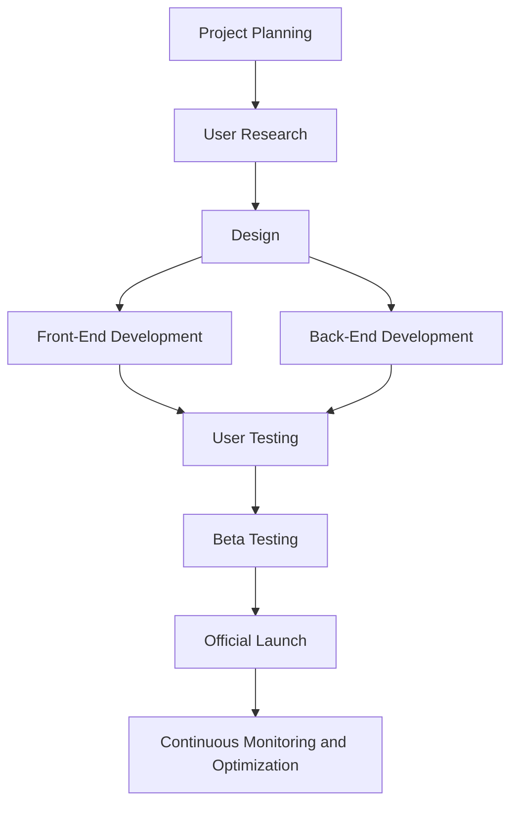

# Opening Source Platform for Intercultural Language Communication

## 📊 Development Workflow (Mermaid Diagram)

Opening Source Platform for Intercultural Language Communication: Bridging the gap between Chinese and local students

ZHUOKAI WU

IS340 

May 15, 2025

## Background

Chinese students in a foreign country often face difficulties in adapting to the language barrier and cultural differences. Although many students have passed their language exams, they still feel timid in daily communication due to insufficient spoken language or lack of understanding of local manners and customs, making it difficult for them to integrate into the local social circle. This situation has led many international students to confine themselves to their native language circle, limiting their socialization and gradually creating a sense of isolation. According to a research white paper, among the biggest challenges encountered by Chinese students studying abroad, academic pressure accounted for 31%, followed by 22% who cited language barriers as the main difficulty, while outside of academics, 15% said adapting to the lifestyle of a new culture was the most difficult. It can be seen that language and cultural barriers seriously affected their study abroad experience. Based on the author's own experiences and those of many international students, we are keenly aware of the need to establish a dedicated platform to help international students practice language and cultural exchange with local students in order to alleviate these adaptation challenges.

## Purpose

This project aims to provide an open digital platform for Chinese international students to connect with local students in their host countries, to enhance mutual understanding through language exchange and cultural sharing, and to help international students integrate more naturally into local life. At the same time, local students can also take this opportunity to learn Chinese and understand Chinese culture, realizing two-way benefits. The platform will integrate various functions to create a safe and fun practice environment for users, encourage international students to open up and make friends, and thus build a bridge to support international students to cross the language and cultural divide. Through this platform, international students will have the opportunity to practice with their local peers, share their cultures, and become more active in campus and community life. The project is developed and operated using an opening source strategy, which means that the platform's code is open and transparent, and developers from around the world can contribute. Drawing on the wisdom of the collaborative community helps us to continuously improve the platform's functionality to better meet the needs of our users. In short, the core purpose of the platform is to promote language learning and cultural integration through the power of technology and community, and to enhance the study abroad experience for Chinese students.

## Vision Statement

Our vision is to create an open and collaborative cross-cultural communication platform that serves as a language and cultural community connecting Chinese students with local students. The platform strives to create a warm and productive environment for users to practice language and share culture in a mutually supportive manner, bridging barriers and promoting tolerance and understanding. Through continuous open-source innovation and community participation, we hope that this cross-cultural bridge will continue to grow, helping more international students to confidently integrate into new environments, and allowing local students to gain multicultural perspectives, realizing true two-way communication and mutual growth.

## Target Audience

The platform mainly serves two groups: Chinese students studying abroad and local students in host countries (especially those who are interested in Chinese language or cross-cultural communication). For Chinese students who are eager to improve their speaking skills, learn about the local culture and make local friends, the platform will meet their needs to practice their language and adapt to the culture in an informal setting. For local students, the platform provides an opportunity to interact with Chinese students who are either learning Chinese, curious about Chinese culture, or looking to expand their international horizons. Through the platform, local students can practice conversational Chinese, learn about Chinese customs and habits, and improve their cross-cultural communication skills by helping others. In addition, the platform also welcomes other users interested in language and culture exchange, but will initially focus on the core group of Chinese students and local university students in their home countries to ensure that the platform's features are designed to meet the needs of these two groups of users. The platform encourages both users to participate with an open mind, so that both international students and local students can gain from the interaction - international students can improve their language skills and integrate into the local community, while local students can broaden their cultural horizons and improve their language skills, thus truly realizing the mutual benefit of the community.

## Features

The platform will provide a series of core features to support language practice and cultural exchange, including but not limited to:

Language Partner Matching: Users will be automatically matched with language partners based on their language proficiency, interests and free time. For example, a Chinese student can be matched with a local student who wants to practice Chinese, and they can have regular video or offline exchanges to practice each other's native language, correct pronunciation, and share cultural insights.

Cultural activity recommendations: Based on the user's city and interests, information on local cultural activities, such as campus club activities, festivals, museum exhibitions, etc., is pushed out weekly. By participating in these activities, international students can experience the local culture more deeply, and local students also have the opportunity to be invited to participate in traditional festivals in the Chinese community, promoting two-way cultural integration.

Language Challenge Tasks: Provide interesting language practice tasks or gamified challenges. For example, daily sentence speaking punch cards, group discussion topics, cultural knowledge quizzes, and so on. Points or badges are awarded for completing the tasks to motivate users to keep practicing. Learning the language and understanding the culture through interaction makes the practicing process more vivid and interesting.

Q&A Community: Built-in discussion forums and Q&A boards for users to ask questions about language learning and cultural differences. Chinese students can ask local students for advice on English usage and local students can learn about Chinese culture and customs. The community encourages senior members to share their experiences, and group moderators or mentors guide newcomers to actively participate, creating a friendly and supportive atmosphere.

The above functions work in tandem to create an all-encompassing platform for users, from one-on-one exchanges to group interactions. For example, users can find partners to practice speaking through matching, participate in activities based on recommendations to enhance friendship, and utilize challenge tasks to consolidate what they've learned and discuss difficult topics in the forum. All of these features are centered around the goal of promoting language practice and cultural exchange.

## Timeline Objectives

Project Planning:

During the project planning phase, we lay a clear foundation for the platform, identify core objectives and success criteria, and develop a roadmap for its realization. First, the team clarifies the scope of the platform and prioritizes functionality - for example, focusing on language partner matching and basic communication functionality for the first release to achieve a minimum viable product (MVP). At the same time, other proposed additions (more gamified tasks, expansion to other language groups, etc.) were listed as considerations for subsequent iterations to prevent the first release from being too large in scope and difficult to complete on time. During the planning process, we referenced the concept of a “roadmap” in project management, dividing the development process into multiple phases with specific milestones for each phase. For example, we will complete the user registration and matching function in phase 1, add the activity recommendation module in phase 2, and launch the challenge game in phase 3. We will create a timeline for each phase, assign tasks to team members, and maintain a degree of flexibility to adjust the plan in a timely manner based on challenges encountered during development. The goal of the planning phase is to create a realistic program that provides direction for subsequent development and ensures that the team reaches a common understanding of the project vision and schedule.

User Research:

Before formal design and development, we will conduct user research to deeply understand the needs and pain points of the target users. The target audience will include both Chinese and local students. We plan to collect feedback through online questionnaires and offline interviews to understand:

What are the main difficulties encountered by Chinese students in language practice and socialization (e.g. is there a lack of local practice opportunities, dissatisfaction with existing language communication channels, etc.)?

What is the interest and motivation of local students in learning Chinese or making international friends, and in what ways do they want to communicate?

What features or support would users like the platform to provide (e.g. matching mechanism, fair language exchange time, information on cultural events, etc.)?

Through in-depth interviews with at least 10 Chinese students and 10 local students, we will distill common needs. For example, many Chinese students may mention that they “lack an easy environment to practice English” or that they “want a local person to take me to experience the culture”, while local students may be concerned about “how to find a reliable language partner” or “I want to find a language partner”. Local students may be concerned about “how to find a reliable language partner” or “I would like to learn some everyday Chinese”. These insights will directly inform platform features and design priorities. We will also research existing language exchange apps or school mentor/buddy programs and summarize their strengths and weaknesses to learn from successes and avoid common pitfalls. The outcome of the user research phase will be a requirements analysis report that identifies the problems that the platform needs to solve and the user expectations that it needs to fulfill, thus informing the design that follows.

Design:

In the design phase, our 3 design volunteers will start designing the platform based on user research insights. First, we will sort out the information architecture and define the main flow of users on the platform (new user registration → fill in personal information and language preference → match partners → start communicating, etc.), and make sure that the functional layout is in line with users' habits. Next, designers will draw wireframes and prototypes to conceptualize a clean and intuitive user interface. We emphasize friendly user experience: for example, guided registration process, multi-language interface prompts, and Chinese/English switching function will be considered in the design to lower the threshold for new users. At the same time, the design team will formulate design specifications, including color font style, component style, etc., to ensure the consistency and continuity of the whole platform's vision. Since this is an open-source collaborative project, good design documentation is also important. We will document the usage of each sector and component to facilitate developers' understanding. Eventually, the design phase will result in high-fidelity interaction prototypes that are reviewed and modified within the team to make them visually and functionally close to the desired final product. At this point, our front-end development team can work on the implementation.

Front-End Development

The Front-End Development phase translates the design into an interactive web interface. The two front-end developers will work closely with the designers to implement the platform's UI using mainstream opening source front-end technology stacks, e.g. we plan to use the React framework to build reusable components to improve development efficiency, and HTML5 and CSS3 to implement responsive layouts to ensure that the platform will look good on both computers and cell phones. During the development process, front-end developers will communicate with designers in a timely manner to ensure that the design intent is restored. In case of inconsistency between design and realization or technical limitations that require adjustment, we will record and feed back into the design process so that these changes can be noted in the documentation. Front-end development not only focuses on interface presentation, but also interfaces with the back-end to realize dynamic data display and interactive functions. For example, getting a list of matches from the backend and displaying it on the interface, or submitting updates to a user's profile. We will use GitHub for version control and collaboration, and open source so that community contributors can easily participate in the development and optimization of front-end modules. The selection of widely used technologies such as React also helps attract more opening source contributors as they are easier to get started with. Through this phase of development, we will gradually build out the main front-end interfaces of the platform, including registration and login page, personal homepage, match list, chat/communication window, activity recommendation list, forum page, etc., to provide user-visible operation entrances for the core functions of the platform.

Back-End Development

In parallel with the front-end, our two back-end developers will focus on the server-side implementation of the platform. The primary task of the back-end is to build the core logic for user management, matching and content processing, and to support the various interfaces required by the front-end. We plan to use Node.js and related frameworks to build the back-end services. The reason for choosing Node is that it uses the same JavaScript as the front-end, which helps to unify the communication between the front-end and the back-end, and Node's event-driven and non-blocking features are suitable for real-time interaction scenarios (e.g., live chat notifications). At the data level, we will use a reliable database (e.g., MongoDB or PostgreSQL) to store data such as user information, match relationships, activity content, and forum posts. The following key functional modules will be implemented in the back-end development phase:

User accounts and permissions: support user registration and login, profile editing to ensure data security and privacy protection.

Matching Algorithm: Algorithm logic for efficient matching based on the language and interest preferences of both parties, and regular updating of matching results.

Messages and notifications: Realize real-time message or notification push, such as new match reminder, activity recommendation push, etc. (Socket.io and other technologies can be considered).

Content Management: Includes an interface for entering and querying activity recommendation information, storing and retrieving forum posts and replies, and a mechanism for monitoring and labeling offending content.

We will deploy the back-end service to a cloud platform (e.g. AWS or Heroku) for testing to ensure that the API response performance meets the requirements. At the same time, we establish the necessary code review and unit testing processes to ensure the quality of the back-end code. Since the platform is under the MIT opening source license, we will also make the backend code publicly hosted on GitHub to make it easy for other developers to submit improvements. The MIT license is a very loose opening source license that allows anyone to freely use, modify and distribute the software. This encourages more volunteers to join the development while we maintain the stability of the project through code reviews and continuous integration.

User Testing

After the development of major features, we invite a group of target users to conduct the first round of user testing. The purpose of this phase is to find out the problems of the product in real use and collect opinions for improvement. We plan to recruit at least 10 Chinese and local students to form a test group, and let them use the beta version of the platform to complete some typical tasks, such as: registering and completing a profile, matching with a language partner and initiating a conversation, browsing and signing up for a cultural event, and posting a question on the forum, etc. During the testing period, we use questionnaires and interviews to find out how to use the platform in real life. During the test period, we obtained feedback from them through questionnaires and interviews, focusing on the following aspects:

Ease of use issues: whether the interface is intuitive, whether the flow is smooth, and whether there are any confusing or stuck areas.

Functionality satisfaction: whether each function meets the user's expectation, e.g. whether the matching result is relevant, whether the activity recommendation is attractive, etc.

Potential Improvement: What features do users want to add or optimize, and are there any errors or crashes encountered.

The test results will be summarized and analyzed by the team, and priority will be given to fixing serious bugs and loopholes, and adjusting unreasonable interaction details. For example, if the test finds that users don't know how to start a conversation next after matching, we will improve the UI prompts. If there is a feature with low usage and mediocre feedback, its design may need to be re-evaluated. Suggestions that are outside the scope of the current release are documented in the product backlog for future iterations. User testing ensures that we improve the product as much as possible before the official release, increasing the success rate of the first experience.

Beta Testing

After making the necessary changes and improvements, we will launch a Beta Test version to open up the platform to a wider range of real users. During the Beta Test phase, we plan to cooperate with relevant student organizations or communities at universities, such as international student unions and language exchange clubs, to invite more Chinese and local students to register to use the platform. Compared with internal user testing, Beta testing is closer to the real operating environment, which we will focus on observing:

User engagement: how many users continue to use the platform, whether the matching exchanges are frequent, how active the forum posting is, etc. This will help us assess the attractiveness of the platform. This will help us evaluate the attractiveness and retention rate of the platform.

System stability: when more users are online at the same time, whether the matching, messaging, recommendation and other functions are still smooth, and whether the server and database can withstand the load. Are there any performance bottlenecks or data errors?

Feedback collection: Collect opinions from Beta users through in-app feedback channels or community discussions. For example, what are their favorite aspects of the platform? What are the areas of dissatisfaction or confusion? Did they encounter bugs, etc.

Beta testing lasts a few weeks, during which time we make quick iterations based on feedback. For example, if a user suggests that they want to add “match by interest” filtering, we may try to add a simple filter in the Beta. For larger architectural issues, we record them and prepare to solve them before the official release, and the goal of beta testing is to validate the functionality and user value of the platform among a small group of real users, to ensure that the risks are minimized when the platform is officially launched to a wider group of people. Through the Beta phase, we can further improve the platform's functionality, optimize its performance, and develop clear user guidance and support documentation.

Launch

After sufficient testing and optimization, the platform will be officially launched. We will release version 1.0 of the platform's website and open it up for registration and use by all target users. Going live means moving from development and testing to actual operation, and we will take the following measures to ensure a smooth transition:

Promotion and community building: We will publicize the platform through the university's international office, social media, and student clubs to attract more Chinese and local students to join. We will also organize online launches or networking events to introduce platform features and invite early users to share their experiences to promote new user registration.

Ongoing monitoring and support: Use the administration backend or analytics tools to monitor the platform's key metrics (e.g., daily active users, number of matches, communication hours, etc.) and keep an eye on user feedback dynamics in the community. In case of emergency problems (e.g. server instability, serious bugs) after the launch, the technical team will respond quickly to fix them. We also arrange community volunteers to act as moderators and mentors to answer new users' questions and provide guidance on usage to ensure good user support services.

Opening Source Community Operation: As the platform code is open source, we will officially release the v1.0 milestone on GitHub and welcome global developers to submit Issue or Pull Request. to maintain the project quality, we will establish clear contribution guidelines and code review process, and develop an open and transparent project governance mechanism. This ensures that the platform's functional evolution remains consistent and reliable while expanding the pool of contributors.

The official launch does not mean the end, but a new starting point. We will continue to collect feedback and data from our users and plan the next step of improvement, such as expanding more forms of cultural exchange and increasing support for other international student groups. Through continuous learning and evolution in operation, we hope that the platform can maintain its vitality in the long run and truly realize its mission of helping cross-cultural groups to connect and support each other.

WORKFOLLOW GRAPH:

Challenges:

Despite the promising future, there are still some challenges that we will face during the implementation of this project, which we need to plan ahead and deal with in a timely manner:

User engagement and retention: The value of the platform can only be realized when there are enough active users. How to attract local students to join and maintain continuous interaction is a major challenge at the initial stage. If only international students have strong demand and local students are not involved enough, the exchange will not form a virtuous cycle. Therefore, we need to improve user retention through incentives (e.g., points exchange, small rewards), mentorship, and interesting activities. In addition, users from different cultural backgrounds may be formal in their first communication, we plan to provide ice-breaking topics and communication guides to help both parties start a smooth conversation and increase the possibility of long-term use.

Opening Source Collaboration and Community Governance: As an opening source project, we welcome external developers to contribute code, but how to manage the growing contributions is also one of the challenges. Without a clear opening source governance mechanism, problems such as development fragmentation and code quality degradation may occur. To this end, we will develop contribution guidelines on GitHub to clarify code style, documentation requirements, and review processes. The core maintenance team will regularly REVIEW the merged code to ensure that the direction of the project is consistent with the original intent. At the same time, we plan to set up a small committee to discuss and decide on major feature changes to keep the project development consistent. This transparent and organized governance will make new contributors feel welcome and ensure that the quality of the project is not diluted.

Scalability and performance: If the platform is to be rolled out to more schools and globally, the system needs to be scalable. Users in different regions may have different needs, such as support for multilingual interfaces, adaptation to the types of cultural activities in different regions, and so on. Technically, we need to ensure that the backend architecture can scale horizontally to accommodate the growing number of users, and that the database can efficiently handle more matching requests and content data. We must design a scalable system architecture in advance, such as using microservices and distributed databases, to allow for smooth scaling in the future. In addition, even in the initial small-scale operation, we focus on the maintainability of the code to avoid excessive technical debt. Complete documentation and testing reduce the risk of pitfalls during future iterations and ensures that the platform remains stable while enriching its functionality.

Cultural differences and content review: The platform is designed for cross-cultural communication, which in itself lends itself to some challenges. For example, cultural misunderstandings or sensitive topics may arise during exchanges, and we need to develop clear community norms to guide users to respect each other's cultural differences. We must intervene promptly if inappropriate comments are made in forums or chats. This requires the establishment of a basic content review mechanism, combined with technical means such as manual management and keyword filtering, to create a safe and inclusive community environment. In addition, in the activity recommendation function, we also need to pay attention to the diversity and balance of the recommended content, reflecting both local characteristics and international students' interests, so as to avoid favoring one over the other.

By anticipating and addressing the above challenges, we are confident that the platform will develop in a healthy and stable direction. As the project progresses, we will continue to assess the risks and adjust our strategy to ensure that these challenges will not prevent the platform from realizing its mission.

Conclusion:

To summarize, the Opening Source Platform for Intercultural Language Communication (OSPILC) aims to be a bridge between Chinese students and local students. Through this open and collaborative platform, international students can more easily practice the language and assimilate into the culture, while local students can learn Chinese and expand their horizons from the exchanges, realizing real two-way benefits. The project adopts an open-source model, opening up the code and decision-making process to the community transparently, just as the open-source philosophy emphasizes: software development is more innovative and efficient due to community collaboration. We believe that with the participation of volunteers and users, the platform's functions will continue to improve, and the community will grow stronger and stronger, bursting with sustained vitality. In the long run, the platform is expected to become an example of a cross-cultural exchange program, proving that an open and shared technology community can play a positive role in the field of social integration. Looking ahead, as long as we stick to our original intention and keep working hard, this platform can help more international students get rid of their language and culture silos and embrace a colorful study abroad life. Meanwhile, we welcome all those who are interested in cross-cultural communication and open-source development to join us and work together to build this warm and creative community better!

 References

Postings, R. (2025, February 3). Chinese students grapple with study and language pressures, report finds. The PIE News. Retrieved from https://thepienews.com/chinese-students-grapple-with-study-and-language-pressures-report-finds/:contentReference[oaicite:12]{index=12}

Opening Source Initiative. (2022, December 19). Community & Collaboration. Retrieved from https://opensource.org/community:contentReference[oaicite:13]{index=13}

Opening Source Initiative. (n.d.). The MIT License. Opening Source Initiative. Retrieved from https://opensource.org/license/mit:contentReference[oaicite:14]{index=14}

University of Maryland. (n.d.). SLLC Language Partner Program. International Student & Scholar Services, University of Maryland. Retrieved from https://marylandglobal.umd.edu/global-learning-all/international-students-scholars/events-programs/sllc-language-partner-program:contentReference[oaicite:15]{index=15}

